# 가비지 컬렉션

자바스크립트는 눈에 보이지 않는 곳에서 메모리 관리를 수행한다

## 가비지 컬렉션 기준

자바스크립트는 `도달 가능성(reachability)`라는 개념을 사용해 메모리 관리를 수행한다.

<br>

`도달 가능한(reachable) 값`은 쉽게 말해 어떻게든 접근하거나 사용할 수 있는 값을 의미한다.

도달 가능한 값은 메모리에서 삭제되지 않는다.

<br>

1. 명백한 이유 없이는 삭제되지 않는 값(태생부터 도달 가능하기 때문)

  - 현재 함수의 지역 변수와 매개 변수
  - 중첩 함수의 체인에 있는 함수에서 사용되는 변수와 매개 변수
  - 전역 변수
  - 기타 등등

이런 값은 `루트`라고 부른다.

2. 루트가 참조하는 값이나 체이닝으로 루트에서 참조할 수 있는 값은 도달 가능한 값이 된다

전역 변수에 객체가 저장되어있다고 가정.

  - 이 객체의 프로터피가 또 다른 객체를 참조하고 있다면, 프로퍼티가 참조하는 객체는 도달 가능한 값이 된다. 이 객체가 참조하는 다른 모든 것들도 도달 가능하다고 여겨짐

---

<h2>예시</h2>

```js
// user엔 객체 참조 값이 저장된다.
let user = {
	name: 'John',
};
```

<br>

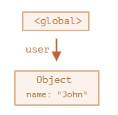

이 그림에서 화살표는 객체 참조를 나타낸다.

전역 변수 `user`는 `{name: 'John}` (줄여서 John)이라는 객체를 참조한다.

John의 프로퍼티 `name`은 원시 값을 저장하고 있기 때문에 객체 안에 표현했다.

`user`의 값을 다른 값으로 덮어쓰면 참조(화살표)가 사라진다.

```js
user = null;
```

<br>

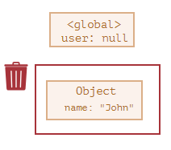

이제 John은 도달할 수 없는 상태가 되었다. John에 접근할 방법, John을 참조한느 것도 모두 사라짐

-> 가비지 컬렉터는 이제 John에 저장된 데이터를 삭제하고, John을 메모리에서 삭제한다.

<br>

## 참조 두 개

참조를 `user`에서 `admin`으로 복사했다고 가정해보자

```js
// user엔 객체 참조 값이 저장된다.
let user = {
  name:'John'
}

let admin = user;
```

그리고 위에서 한 것처럼 `user`의 값을 없앤다

```js
user = null;
```

전역 변수 `admin`을 통하면 여전히 객체 John에 접근할 수 있기 떄문에 John은 메모리에서 삭제되지 않는다. 이 상태에서 `admin`을 다른 값(null 등)으로 덮으쓰면 John은 메모리에서 삭제될 수 있다.

<br>

## 연결된 객체

이제 가족 관계를 나타내는 복잡한 예시를 살펴보자

```js
function marry(man, woman) {
  woman.husband = man;
  man.wife = woman;

  return {
    father: man,
    mother: woman,
  }
}

let family = marry(
  {name: 'John'},
  {name:'Ann'},
  )
```

함수 `marry`는 매개 변수로 받은 두 객체를 서로 참조하게 하면서 '결혼'시키고, 두 객체를 포함하는 새로운 객체를 반환한다.

메모리 구조는 아래와 같다.

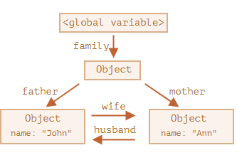

지금은 모든 객체가 도달 가능한 상태이다.

이제 참조 두 개를 지워보자

```js
delete family.father;
delete family.mother.hunband;
```

<br>

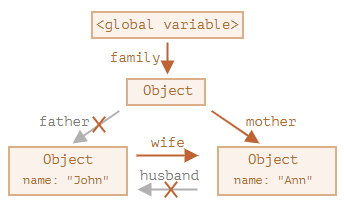

삭제한 두 개의 참조 중 하나만 지웠다면, 모든 객체가 여전히 도달 가능한 상태였을 것이다.

하지만 참조 두 개를 지우면 John으로 들어오는 참조(화살표)는 모두 사라져 John은 도달 가능한 상태에서 벗어난다.

<br>

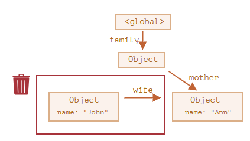

외부로 나가는 참조는 도달 가능한 상태에 영향을 주지 않는다. 외부에서 **`들어오는`** 참조만이 도달 가능한 상태에 영향을 준다.

John은 이제 도달 가능한 상태가 아니기 때문에 메모리에서 제거된다. John에 저장된 데이터(프로퍼티) 역시 메모리에서 사라진다.

<br>

가비지 컬렉션 후 메모리 구조는 아래와 같다.

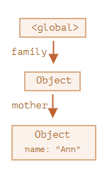

<br>

## 도달할 수 없는 섬

객체들이 연결되어 섬 같은 구조를 만드는데, 이 섬에 도달할 방법이 없는 경우, 섬을 구성하는 객체 전부가 메모리에서 삭제된다.

근원 객체 `family`가 아무것도 참조하지 않도록 해보자.

<br>

`family = null;`

<br>

이제 메모리 내부의 상태는 다음과 같아진다.

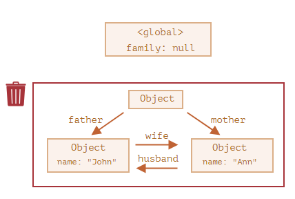

도달할 수 없는 섬 예제는 도달 가능성이라는 개념이 얼마나 중요한지 보여준다.

John과 Ann은 여전히 서로를 참조하고 있고, 두 객체 모두 외부에서 들어오는 참조를 갖고 있지만, 이것만으로는 충분하지 않다는걸 보여줌

`family` 객체와 루트의 연결이 사라지면 루트 객체를 참조하는 것이 아무것도 없게 된다. 섬 전체가 도달할 수 없는 상태가 되고, 섬을 구성하는 객체 전부가 메모리에서 제거됨

<br>

## 내부 알고리즘

**`mark-and-sweep`** 이라 불리는 가비지 컬렉션 기본 알고리즘이 있다

**가비지 컬렉션**은 대개 다음 단계를 거쳐 수행된다.

1. 가비지 컬렉터는 루트 정보를 수집하고 이를 mark(기억)함
2. 루트가 참조하고 있는 모든 객체를 방문하고 이것들을 mark함
3. mark된 모든 객체에 방문하고 그 객체들이 참조하는 객체도 mark함(한번 방문한 객체는 전부 mark하기 때문에 같은 객체를 다시 방문하는 일은 없음)
4. 루트에서 도달 가능한 모든 객체를 방문할 때 까지 위 과정을 반복함
5. mark되지 않은 모든 객체를 메모리에서 삭제함

<br>

다음과 같은 객체 구조가 있다

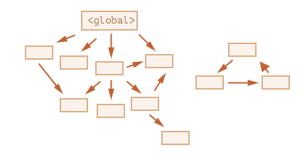

오른 편에 `도달할 수 없는 섬`이 존재한다. 이를 가비지 컬렉터의 `mark-and-sweep- 알고리즘이 처리하는 방법은

첫 번째로는 루트를 mark함

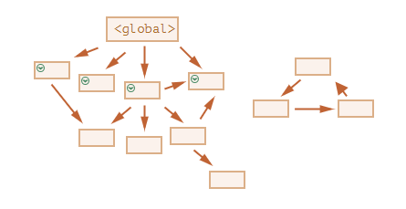

이후 루트가 참조하고 있는 것들을 mark한다

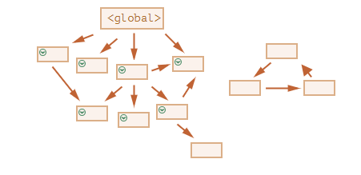

도달 가능한 모든 객체를 방문할 때 까지, mark한 객체가 참조하는 객체를 계속해서 mark한다.

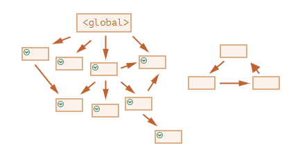

방문할 수 없었던 객체를 메모리에서 삭제한다.

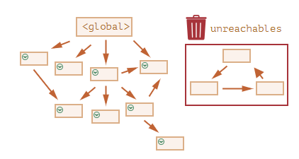

루트에서 페인트를 들이붓는다고 상상하면 이해하기 쉽다.

루트를 시작으로 참조를 따라가면서 도달 가능한 객체 모두에 페인트가 칠해지고, 묻지 않은 객체(닿아있지 않으므로)들은 메모리에서 삭제된다.

<br>

자바스크립트 엔진은 실행에 영향을 미치지 않으며 가비지 커렉션을 더 빠르게 하는 다양한 최적화 기법을 사용한다.

- **generational collection(세대별 수집)**: 객체를 `새로운 객체`와 `오래된 객체`로 나눈다. 객체 상당수는 생성 이후 제 역할을 빠르게 수행하고 금방 쓸모가 없어지는데, 이런 객체를 `새로운 객체`로 구분하고 가비지 컬렉터는 이런 객체를 공격적으로 메모리에서 제거한다. 일정 시간 이상 살아남은 객체는 `오래된 객체`로 분류되어 가비지 컬렉터가 감시를 덜함

- **incremental collection(점진적 수집)**: 방문해야 할 객체가 많다면 모든 객체를 한번에 방문하고 mark 하는데 많은 시간이 든다. 가비지 컬렉션에 많은 리소스가 사용되어 실행 속도도 눈에 띄게 느려질 것. <br> 이런 현상을 개션하기 위해 가비지 컬렉션을 여러 부분으로 분리한 다음 각 부분을 별도로 수행한다. 작업을 분리하고, 변경 사항을 추적하는 데 추가 작업이 필요하지만 긴 지연을 짧은 지연 여러 개로 분산시킬 수 있다는 장점이 있음

- **idle-time collection(유휴 시간 수집)**: 가비지 컬렉터는 실행에 주는 영향을 최소화하기 위해 CPU가 유휴 상태일 때만 가비지 컬렉션을 실행한다.

<br>

이 외에도 엄청 많음